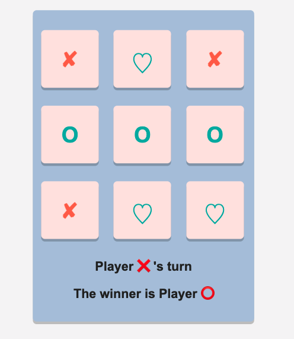
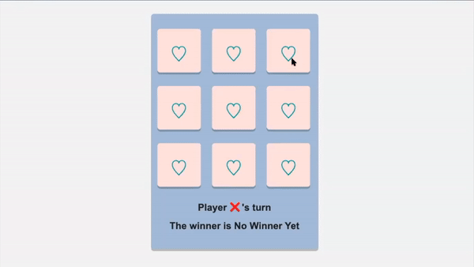

# Tic-Tac-Toe App

A 2-player Tic-Tac-Toe game built with React.

## Tasks:

    Display the next player to play (Player ❌ or Player ⭕️). This should show which player's turn it is. It should be updated every time a player selects a square
    Update the color of the mark based on the player's turn. "✘" should be red, and "O" should be green.

At the end, the game should look like the following:
 

The text showing the player in turn (Player ❌'s turn) should be displayed below the board and should be contained within an `<h1></h1>`  tag and have the id turn.

## Solution
I use conditional logic via a ternary operator to set the `className` value. Learn more about the ternary operator here._ o Learn more about the [ternary operator](https://developer.mozilla.org/en-US/docs/Web/JavaScript/Reference/Operators/Conditional_Operator/) 

```javaScript
className={tik == "1" ? "red" : "green"}
      onClick={() => {
        setTik(takeTurn(id));
        setFilled(true);
        console.log(`Square: ${id} filled by player : ${tik}`);
      }}
    >
      <h1>{mark[tik]}</h1>
```

## Usage
 

[Live demo](#)

## Features
✘ ❤︎ Pastel UI

## Installation
`npx create-react-app tic-tac-toe-app`
`cd tic-tac-toe-app`
`npm start`

    Note

    npx on the first line is not a typo — it is a package runner tool that comes with npm 5.2+.

### `npm start`

Runs the app in the development mode.\
Open [http://localhost:3000](http://localhost:3000) to view it in the browser.

The page will reload if you make edits.\
You will also see any lint errors in the console.

## Learn More

You can learn more in the [Create React App documentation](https://facebook.github.io/create-react-app/docs/getting-started).

To learn React, check out the [React documentation](https://reactjs.org/), [React Game Examples](https://react.rocks/tag/Game/).

## Roadmap
I want to create a start new button and a Human VS. Machine version .

## License
[MIT](https://github.com/anyapages/tic-tac-toe-app/blob/main/LICENSE) 
